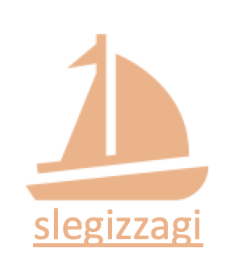

  

# 20-1 SleProject

> * 슬기짜기 프로젝트는 슬기짜기 모든 인원들이 최소 하나의 Project에 참여하여 Project 건설에 기여합니다.
> * SleProject는 차후 슬기짜기 선배들에게 (현업에서 일하는 선배) 조언을 받을 수 있는 혜택이 있습니다.

> - ⛵️ 프로젝트는 한 척의 배가 넓은 바다를 항해하는 것과 같습니다. 배에 탄 crew들은 모두 자신들의 role을 통헤 배가 큰 차질 없이 목적지에 도착하는 것입니다.
> - Role은 프로젝트에 따라 세분화 혹은 수정이 충분히 가능합니다.

### Role

- **🔭 기획자:** 프로젝트의 3가지 요소를 정한다. 시작점(start), 종착점(end), 마디점(node).
- **⚓️ 개발자:** 프로젝트에서 마디점을 연결하는 역할을 한다
- **✨ 디자이너:** 프로젝트의 시작점, 종착점 그리고 마디점들을 알맞게 색칠하는 역할을 한다.

## Registered Project

### [Slegizzagi Tech Blog 개설](./SleTechBlog/README.md)
* GitHub repository로 동아리가 운영 되는 현실이 안탑깝습니다....ㅠㅠ
* React와 AWS를 사용해서 슬기짜기 동아리 한번 만들어보죠!!!

### [Global Warming](./Global%20Warming)

* 지구가 뜨거워지고 있는 원인, 속도 그리고 결과 및 효과에 대해서 알아보는 것이 목표이다.
* 기존의 신뢰도가 있는 data를 기반 우리가 만든 간단한 알고리즘을 통해 결과를 예측할 수 있는 **통계 툴**을 만들어보자.

### 공모전

* 하나의 System을 설계 합니다.
* 설계된 System을 업그레이드 시켜 참가 할 수 있는 모든 공모전에 대하여 준비합니다.
* [Project Syllabus를 작성해주세요](https://github.com/HGU-slegizzagi/20-1/blob/master/project/project_detail_format.md)
